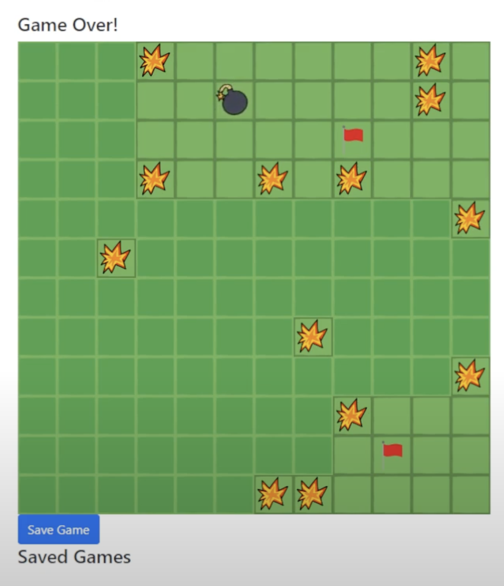

# Minesweeper
C# III Milestone

This project will be using .NET with to create a web application to allow users to play minesweeper.

## Setup

Clone this repository:
`git clone github.com/scottwmaxwell/minesweeper`

## Contribute
You can either commit to the main branch or create separate issues for each branch. 
If you include `Closes #<issuenum>` in the commit message, it will automatically close the issue once pushed to the main branch.

To switch to a different branch:
- `git fetch origin`
- `git checkout <branchname>`

To make a commit:
- `git add .`
- `git commit -m "commit message"`

To push the commit(s):
- `git push origin <branchname>`
